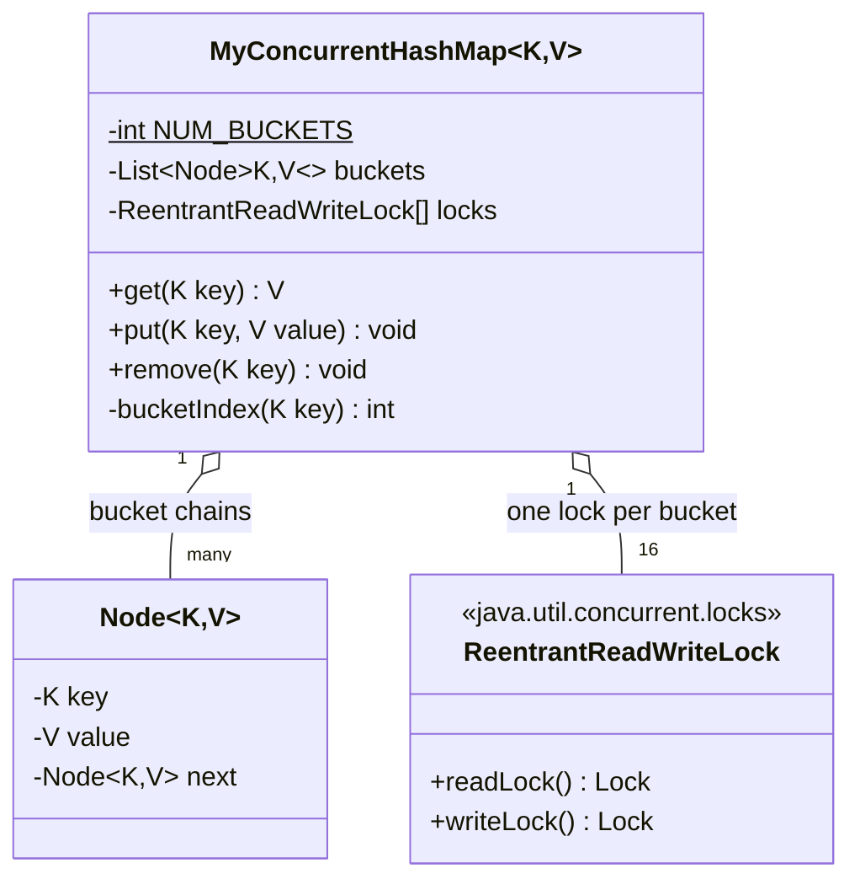

# 🔒 Concurrent HashMap (Build Your Own) — Full LLD Design Guide

> Planning approach → design diagram → senior-level Java implementation → interview talking points.

---

## 🔵 1. How to Plan It — The Approach & Thought Process

### Step 1: Clarify requirements first

- Does it need to support resize (growing the bucket array), or is a fixed bucket count acceptable for this exercise?
- Read-heavy or write-heavy workload assumed? (Changes whether `ReadWriteLock` or a simpler `synchronized` is the right call.)
- Do we need `remove()`, or just `get`/`put`?
- Is strict consistency required (a `get()` right after a `put()` on another thread must see it), or is eventual consistency acceptable?

### Step 2: Identify the actual problem — this ISN'T primarily a design-pattern question

Unlike Parking Lot or Reservation systems, Concurrent HashMap is fundamentally a **concurrency-control exercise wearing a data-structure costume.** The interviewer is testing: do you understand *why* a plain `HashMap` breaks under concurrent access, and can you fix it with the right granularity of locking — not whether you know GoF patterns.

### Step 3: Name the actual failure mode of a plain `HashMap` under concurrency, before writing any fix

Two concrete failures, and you should be able to state both:
1. **Lost updates** — two threads both read the same bucket's linked list, both prepend a new node, and one overwrites the other's write (classic check-then-act race, same shape as the Parking Lot spot-claim problem).
2. **Structural corruption during resize** — in old Java 7 `HashMap`, concurrent resizing could literally create a **cyclic linked list**, causing an infinite loop on `get()`. You don't need to reproduce this bug, but naming it shows you understand *why* this problem is taken so seriously.

### Step 4: Decide the locking granularity — this is the entire design decision

| Approach | What it protects | Tradeoff |
|---|---|---|
| One global `synchronized` on every method | Everything | Correct, but zero parallelism — every thread queues behind every other thread, even for unrelated keys |
| One lock **per bucket** | Only operations on the same bucket contend | The right balance — operations on different buckets run fully in parallel |
| Lock-free (CAS-based) | Avoids blocking entirely | Much harder to get right correctly; usually reserved for very hot paths |

**The answer to reach for in an interview, and the one implemented below: per-bucket `ReadWriteLock`.** It's the sweet spot between "trivially correct but slow" and "fast but hard to prove correct."

### Step 5: Decide read vs write lock semantics

Ask explicitly: *"do two concurrent reads on the SAME bucket need to block each other?"* No — reads don't conflict with reads. This is exactly why `ReentrantReadWriteLock` (not plain `synchronized`) is the right primitive — multiple `get()` calls on one bucket proceed together; only a `put()`/`remove()` needs exclusivity.

### Step 6: Write the skeleton before the method bodies

```
MyConcurrentHashMap<K, V>
  - buckets: List<Node<K,V>>   (each entry is the head of a linked list)
  - locks: ReentrantReadWriteLock[]   (ONE per bucket, not one per map)
  + get(K) V
  + put(K, V) void
  + remove(K) void
```

---

## 🟢 2. Design Diagram



**ASCII fallback:**
```
MyConcurrentHashMap<K, V>
├── buckets: [ bucket0 -> bucket1 -> ... -> bucket15 ]   (each is a linked-list head)
├── locks:   [ lock0,    lock1,    ..., lock15 ]         (ReentrantReadWriteLock, ONE per bucket)
│
│   bucket[3]:  Node(keyA) -> Node(keyB) -> null
│                 ▲
│              guarded by locks[3] ONLY — put/get on bucket[7] never waits on this lock
│
get(key)  -> bucketIndex(key) -> locks[idx].readLock()  -> walk linked list -> unlock
put(key)  -> bucketIndex(key) -> locks[idx].writeLock() -> update/insert    -> unlock
```

---

## 🟠 3. Senior-Level Java Implementation

```java
import java.util.ArrayList;
import java.util.List;
import java.util.concurrent.locks.ReentrantReadWriteLock;

/**
 * A hand-rolled thread-safe map using per-bucket locking — the same
 * fundamental idea Java's real java.util.concurrent.ConcurrentHashMap uses
 * (segment/bin-level locking rather than one lock for the whole map).
 *
 * Design decision stated up front: bucket count is FIXED at construction.
 * Supporting resize is a legitimate, common follow-up (see notes below) but
 * deliberately out of scope for the base implementation, to keep the core
 * locking logic clear first.
 */
class MyConcurrentHashMap<K, V> {
    private static final int DEFAULT_BUCKET_COUNT = 16;

    private static class Node<K, V> {
        final K key;
        volatile V value; // volatile: a get() on another thread must see the latest write
        volatile Node<K, V> next;

        Node(K key, V value) {
            this.key = key;
            this.value = value;
        }
    }

    private final Node<K, V>[] buckets;
    private final ReentrantReadWriteLock[] locks;

    @SuppressWarnings("unchecked")
    MyConcurrentHashMap(int bucketCount) {
        buckets = (Node<K, V>[]) new Node[bucketCount];
        locks = new ReentrantReadWriteLock[bucketCount];
        for (int i = 0; i < bucketCount; i++) {
            locks[i] = new ReentrantReadWriteLock();
        }
    }

    MyConcurrentHashMap() {
        this(DEFAULT_BUCKET_COUNT);
    }

    private int bucketIndex(K key) {
        // spread the hash a bit (like real HashMap does) to reduce clustering
        int h = key.hashCode();
        h ^= (h >>> 16);
        return Math.abs(h) % buckets.length;
    }

    public V get(K key) {
        int idx = bucketIndex(key);
        locks[idx].readLock().lock(); // multiple readers on the SAME bucket proceed together
        try {
            Node<K, V> node = buckets[idx];
            while (node != null) {
                if (node.key.equals(key)) return node.value;
                node = node.next;
            }
            return null;
        } finally {
            locks[idx].readLock().unlock();
        }
    }

    public void put(K key, V value) {
        int idx = bucketIndex(key);
        locks[idx].writeLock().lock(); // exclusive — blocks reads/writes on THIS bucket only
        try {
            Node<K, V> node = buckets[idx];
            while (node != null) {
                if (node.key.equals(key)) {
                    node.value = value; // update in place
                    return;
                }
                node = node.next;
            }
            // insert at head — O(1), no need to walk to the end
            Node<K, V> newNode = new Node<>(key, value);
            newNode.next = buckets[idx];
            buckets[idx] = newNode;
        } finally {
            locks[idx].writeLock().unlock();
        }
    }

    public void remove(K key) {
        int idx = bucketIndex(key);
        locks[idx].writeLock().lock();
        try {
            Node<K, V> node = buckets[idx];
            Node<K, V> prev = null;
            while (node != null) {
                if (node.key.equals(key)) {
                    if (prev == null) buckets[idx] = node.next; // removing the head
                    else prev.next = node.next;
                    return;
                }
                prev = node;
                node = node.next;
            }
        } finally {
            locks[idx].writeLock().unlock();
        }
    }

    /** Approximate size — deliberately NOT lock-free-safe across ALL buckets
     *  simultaneously; a truly consistent size() would need to lock every
     *  bucket at once, defeating the whole point of per-bucket locking. This
     *  tradeoff is exactly what real ConcurrentHashMap accepts too. */
    public int approximateSize() {
        int count = 0;
        for (int i = 0; i < buckets.length; i++) {
            locks[i].readLock().lock();
            try {
                Node<K, V> node = buckets[i];
                while (node != null) { count++; node = node.next; }
            } finally {
                locks[i].readLock().unlock();
            }
        }
        return count;
    }
}

public class ConcurrentHashMapDemo {
    public static void main(String[] args) throws InterruptedException {
        MyConcurrentHashMap<String, Integer> map = new MyConcurrentHashMap<>();

        Runnable writer1 = () -> { for (int i = 0; i < 1000; i++) map.put("key" + i, i); };
        Runnable writer2 = () -> { for (int i = 1000; i < 2000; i++) map.put("key" + i, i); };

        Thread t1 = new Thread(writer1);
        Thread t2 = new Thread(writer2);
        t1.start(); t2.start();
        t1.join(); t2.join();

        System.out.println("key500 = " + map.get("key500"));
        System.out.println("key1500 = " + map.get("key1500"));
        System.out.println("approx size = " + map.approximateSize());
    }
}
```

### Senior-level design decisions worth stating out loud in the interview

- **`volatile` on `Node.value` and `Node.next`** — without it, a write on one thread might not become visible to a `get()` on another thread promptly, even with the lock protecting *mutation ordering*; `volatile` guarantees visibility for the read-without-a-lock-held-yet moment right as you enter the method (defense in depth alongside the lock itself).
- **Hash spreading (`h ^= (h >>> 16)`)** — mirrors what real `HashMap`/`ConcurrentHashMap` do internally; without it, poor `hashCode()` implementations cluster into a few buckets, defeating the whole point of bucket-level parallelism.
- **`approximateSize()` explicitly documented as approximate** — naming this tradeoff out loud (rather than silently implementing a "wrong" size that looks exact) is exactly the kind of honesty a Staff-level interviewer is listening for.
- **Insert-at-head, not tail** — O(1) insert instead of walking the whole chain; a small but real detail that shows attention to complexity, not just correctness.

---

## 🟣 Glossary

| Term | Meaning |
|---|---|
| **Bucket / bin** | One slot in the underlying array, holding a linked list of entries that hashed to the same index |
| **Lock granularity** | How much of the data structure one lock covers — per-bucket here, vs. one global lock |
| **Hash spreading** | Mixing high and low bits of a hash code so poor `hashCode()` implementations don't cluster into few buckets |
| **Lost update** | Two threads both read-modify-write the same data without synchronization, and one write silently overwrites the other |

---

## ✅ 30-Second Recap
- [ ] This is a concurrency-control exercise first, data-structure exercise second — name the failure mode (lost updates, resize corruption) before proposing the fix
- [ ] Per-bucket `ReentrantReadWriteLock` is the sweet spot between "global lock, fully correct but serial" and "lock-free, fast but hard to prove correct"
- [ ] `volatile` fields + lock together give both mutation-ordering safety AND cross-thread visibility
- [ ] `approximateSize()` is a deliberate, named tradeoff — don't pretend it's exact

**Follow-up interview questions to expect on this topic:**
1. How would you add resize support (growing from 16 to 32 buckets) without a stop-the-world pause across every bucket — walk through incremental migration.
2. If two different keys hash to the same bucket and are inserted by two threads at the exact same time, walk through the exact sequence of lock acquisitions that makes this safe.