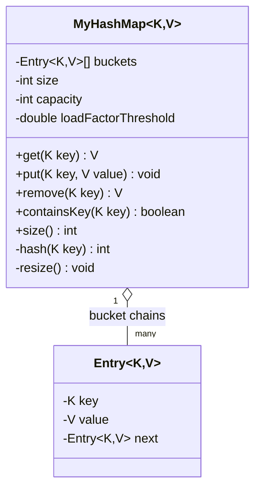

# 🗺️ Build Your Own HashMap (Core, Single-Threaded) — Full LLD Design Guide

> This is the base version — resizing, collision handling, load factor — before adding thread-safety (that's the separate Concurrent HashMap variant already covered). This exact "implement HashMap from scratch" is one of the most frequently asked LLD/coding-round questions across senior backend interviews.

---

## 🔵 1. How to Plan It — The Approach & Thought Process

### Step 1: Clarify requirements first
- Generic `<K, V>`? (Almost always yes.)
- Collision handling strategy — chaining (linked list/tree per bucket) or open addressing (probing)? **Chaining is what real Java `HashMap` uses and what interviewers expect by default** — mention open addressing exists as an alternative, but implement chaining unless told otherwise.
- Does it need to resize dynamically as it fills up, or is a fixed capacity acceptable? (Resizing is almost always expected — it's the part that actually tests your understanding, not just "wire up an array.")
- Does `null` need to be a valid key/value? (Real `HashMap` allows one null key — worth mentioning, optional to implement.)

### Step 2: Identify the core mechanism — hashing + indexing

Every operation boils down to: **take a key → compute a hash → convert that hash into a valid array index → go to that bucket.** Everything else (resize, collision handling, load factor) exists to keep that one operation fast (close to O(1)) as the map grows.

### Step 3: Name the two real design problems before writing code

1. **Collisions** — two different keys can hash to the same bucket. Fix: each bucket holds a **linked list** (or a list) of entries; on collision, just append/search within that list.
2. **Degradation as it fills up** — if too many keys land in the same buckets, each bucket's list grows long, and lookups degrade from O(1) toward O(n). Fix: **track a load factor** (entries / bucket count) and **resize** (double the bucket array, rehash everything) once it crosses a threshold (typically 0.75).

### Step 4: Decide the resize trigger and growth factor explicitly

- **Load factor threshold: 0.75** — this exact number is what real Java `HashMap` uses, and it's a genuine engineering tradeoff: too low (e.g., 0.5) wastes memory (lots of empty buckets); too high (e.g., 0.9) causes long chains and slower lookups. Knowing *why* 0.75 is the sweet spot (not just that it exists) is a strong interview signal.
- **Growth factor: double the capacity** — halves the amortized cost of resizing (doubling means resizes happen exponentially less often as the map grows, keeping average insert cost O(1) amortized).

### Step 5: Decide what "resize" actually requires — this is the part people get wrong

Resizing isn't just "make a bigger array" — **every existing entry must be rehashed**, because the bucket index formula (`hash % capacity`) depends on capacity. If capacity changes, the same key's index changes too. Skipping this and just copying the old array leaves entries unreachable in their old (now-wrong) buckets.

### Step 6: Write the skeleton before the method bodies

```
MyHashMap<K, V>
  - buckets: List<Entry<K,V>>[]
  - size: int
  - capacity: int
  - loadFactorThreshold: double = 0.75
  + get(K) V
  + put(K, V) void
  + remove(K) V
  + containsKey(K) boolean
  + size() int
  - resize() void
  - hash(K) int
```

---

## 🟢 2. Design Diagram



**ASCII fallback:**
```
MyHashMap<K, V>
capacity = 16, size = 3, loadFactor = 3/16 = 0.1875 (below 0.75 threshold, no resize needed)

buckets:
  [0]  -> null
  [1]  -> Entry(keyA, valA) -> Entry(keyE, valE) -> null   <- collision: 2 keys, same bucket
  [2]  -> null
  ...
  [7]  -> Entry(keyB, valB) -> null
  ...
  [15] -> null

put(key, value):
  idx = hash(key) % capacity
  walk buckets[idx]'s chain -> if key found, update value
                              -> else append new Entry at head
  size++
  if (size / capacity > 0.75) -> resize()  // double capacity, REHASH every entry
```

---

## 🟠 3. Senior-Level Java Implementation

```java
import java.util.NoSuchElementException;

/**
 * A from-scratch HashMap using separate chaining for collisions and
 * dynamic resizing at a 0.75 load factor — mirroring java.util.HashMap's
 * actual design decisions, single-threaded (no locking; that's a distinct
 * follow-on problem, not part of this core implementation).
 */
class MyHashMap<K, V> {
    private static final int DEFAULT_CAPACITY = 16;
    private static final double LOAD_FACTOR_THRESHOLD = 0.75;

    private static class Entry<K, V> {
        final K key;
        V value;
        Entry<K, V> next; // collision chain

        Entry(K key, V value) {
            this.key = key;
            this.value = value;
        }
    }

    private Entry<K, V>[] buckets;
    private int size = 0;
    private int capacity;

    @SuppressWarnings("unchecked")
    MyHashMap() {
        this.capacity = DEFAULT_CAPACITY;
        this.buckets = new Entry[capacity];
    }

    /**
     * Spreads the hash (mixes high bits into the low bits) before masking
     * to the bucket count. Without this, keys whose hashCode() only
     * differs in high bits (a common pattern for poorly-written
     * hashCode() implementations, or sequential Integer keys shifted left)
     * would all collide into the same few low-order buckets.
     */
    private int hash(K key) {
        if (key == null) return 0;
        int h = key.hashCode();
        h ^= (h >>> 16);
        return Math.abs(h) % capacity;
    }

    public void put(K key, V value) {
        int idx = hash(key);
        Entry<K, V> node = buckets[idx];

        while (node != null) {
            if (keysEqual(node.key, key)) {
                node.value = value; // key already exists — update, size unchanged
                return;
            }
            node = node.next;
        }

        // key not found — insert new entry at the head of this bucket's chain
        Entry<K, V> newEntry = new Entry<>(key, value);
        newEntry.next = buckets[idx];
        buckets[idx] = newEntry;
        size++;

        if ((double) size / capacity > LOAD_FACTOR_THRESHOLD) {
            resize();
        }
    }

    public V get(K key) {
        int idx = hash(key);
        Entry<K, V> node = buckets[idx];
        while (node != null) {
            if (keysEqual(node.key, key)) return node.value;
            node = node.next;
        }
        return null;
    }

    public V remove(K key) {
        int idx = hash(key);
        Entry<K, V> node = buckets[idx];
        Entry<K, V> prev = null;

        while (node != null) {
            if (keysEqual(node.key, key)) {
                if (prev == null) buckets[idx] = node.next; // removing chain head
                else prev.next = node.next;
                size--;
                return node.value;
            }
            prev = node;
            node = node.next;
        }
        return null; // key not found
    }

    public boolean containsKey(K key) {
        int idx = hash(key);
        Entry<K, V> node = buckets[idx];
        while (node != null) {
            if (keysEqual(node.key, key)) return true;
            node = node.next;
        }
        return false;
    }

    public int size() { return size; }

    private boolean keysEqual(K a, K b) {
        return (a == null && b == null) || (a != null && a.equals(b));
    }

    /**
     * THE critical operation: doubling capacity is only half the work —
     * every existing entry's bucket index depends on `capacity` (via
     * hash() % capacity), so changing capacity WITHOUT rehashing leaves
     * every entry unreachable in its old, now-incorrect bucket.
     */
    @SuppressWarnings("unchecked")
    private void resize() {
        Entry<K, V>[] oldBuckets = buckets;
        capacity = capacity * 2;
        buckets = new Entry[capacity];
        size = 0; // will be re-incremented as we re-insert via put()

        for (Entry<K, V> head : oldBuckets) {
            Entry<K, V> node = head;
            while (node != null) {
                put(node.key, node.value); // re-hash into the new, bigger bucket array
                node = node.next;
            }
        }
    }
}

public class MyHashMapDemo {
    public static void main(String[] args) {
        MyHashMap<String, Integer> map = new MyHashMap<>();

        for (int i = 0; i < 20; i++) { // 20 entries will cross the 0.75 threshold on a 16-bucket map, triggering resize
            map.put("key" + i, i);
        }

        System.out.println("size = " + map.size());
        System.out.println("key5 = " + map.get("key5"));
        System.out.println("key19 = " + map.get("key19"));

        map.remove("key5");
        System.out.println("key5 after remove = " + map.get("key5"));
        System.out.println("containsKey(key5) = " + map.containsKey("key5"));
        System.out.println("final size = " + map.size());
    }
}
```

### Senior-level design decisions worth stating out loud in the interview

- **Insert at the HEAD of the chain, not the tail** — O(1) insert for new keys instead of walking the full chain first; only updates (existing key) require a full walk, which is unavoidable since you must find the existing entry.
- **`resize()` reuses `put()` rather than duplicating insertion logic** — DRY, and correctness-preserving: since `put()` already handles hashing + chain insertion + collision correctly, re-running every old entry through it during resize guarantees consistent behavior instead of a parallel, possibly-buggy reimplementation.
- **Hash spreading (`h ^= (h >>> 16)`)** — same technique as the Concurrent version; without it, poor `hashCode()` implementations cluster into a handful of buckets, defeating the whole point of hashing.
- **`keysEqual()` handles `null` keys explicitly** — real `HashMap` supports one `null` key; naming this edge case, even if you choose not to support it, shows attention to the actual contract you're implementing.

---

## 🟣 The interview-critical follow-up: `equals()`/`hashCode()` contract

**This is the single most commonly asked "gotcha" question on this exact topic**, and it's worth pre-empting: this whole design silently assumes keys have a **consistent** `hashCode()` (same key object always returns the same hash) and that `equals()` and `hashCode()` are **consistent with each other** (if `a.equals(b)` is true, `a.hashCode()` must equal `b.hashCode()`). If a custom key class overrides `equals()` but forgets `hashCode()` (or vice versa), this map silently breaks: two "equal" keys could land in different buckets and never be found as duplicates, or worse, be treated as always-different — a real, common bug in custom classes used as map keys.

---

## ✅ 30-Second Recap
- [ ] Chaining (linked list per bucket) is the default/expected collision strategy — mention open addressing exists, but implement chaining
- [ ] Load factor 0.75 + doubling capacity on resize is the standard, defensible design — know *why* 0.75 (memory vs. chain-length tradeoff)
- [ ] Resize = allocate bigger array AND rehash every existing entry — never just copy the array
- [ ] The `equals()`/`hashCode()` contract is the most likely "gotcha" follow-up — be ready to explain what breaks if a key class violates it

**Follow-up interview questions to expect on this topic:**
1. Real Java 8+ `HashMap` converts a bucket's linked list into a red-black tree once that single bucket's chain exceeds 8 entries — why would they do that, and what does it change about worst-case lookup time?
2. If you needed this map to preserve insertion order (like `LinkedHashMap`), what would you add to `Entry` and to `put()`/`remove()` to support that?