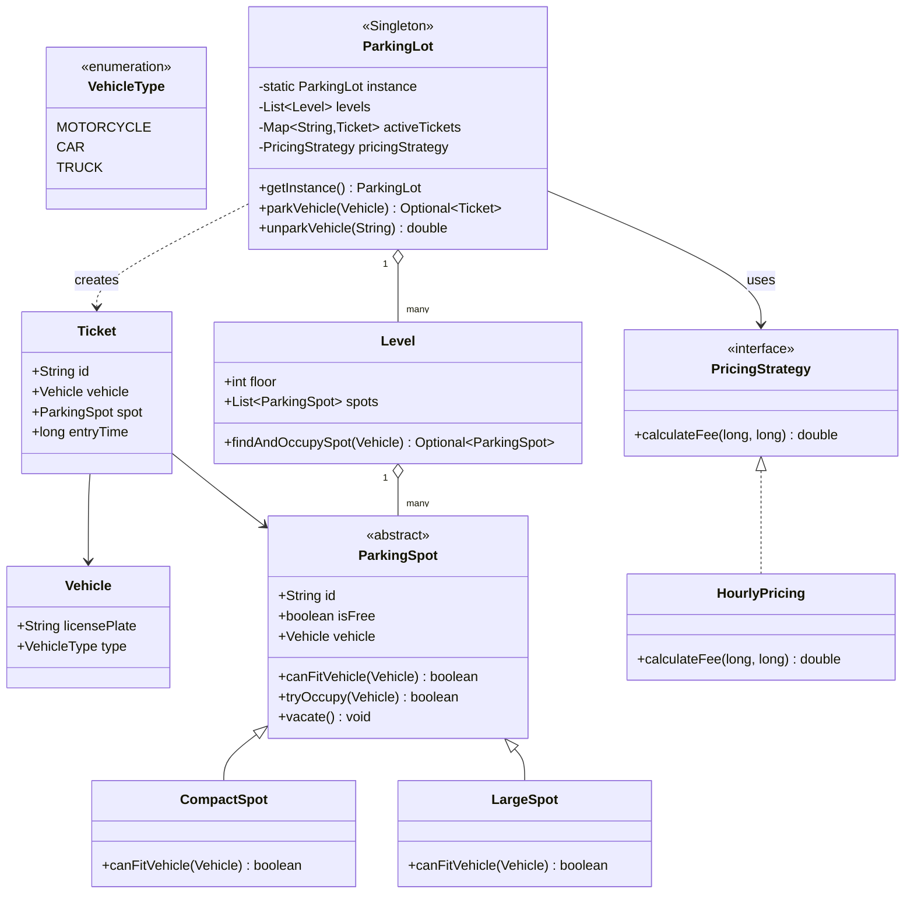

# 🅿️ Parking Lot — Full LLD Design Guide

> Planning approach → design diagram → senior-level Java implementation with design patterns → interview talking points.

---

## 🔵 1. How to Plan It — The Approach & Thought Process

### Step 1: Clarify requirements FIRST, out loud, before touching a class name

An interviewer deliberately gives you an under-specified prompt ("design a parking lot"). The senior-level move is to ask clarifying questions, not assume:

- How many floors/levels?
- What vehicle types (motorcycle, car, truck/bus)? Do larger vehicles need larger spots?
- Is pricing flat, hourly, or does it vary (weekday/weekend, EV charging spot premium)?
- Do we need payment processing, or just fee *calculation*?
- Multi-entry/exit gates? Does that matter for this exercise?
- Do we need to support **concurrent** access (multiple entry gates simultaneously)? — **this is the detail that turns a "simple OOP exercise" into a real systems question**, and it's the one most candidates skip asking about.

### Step 2: Identify the nouns (entities) — these become your classes

Read the requirements and underline every noun: Vehicle, ParkingSpot, Level, ParkingLot, Ticket, Payment. Each becomes a candidate class. Don't skip this — jumping straight to code without this step is how people end up with a tangled design mid-interview.

### Step 3: Identify the verbs (behaviors) — these become your methods, and hint at your patterns

- "Park a vehicle" → needs to search + claim a spot → **this claim operation is where concurrency-safety must be designed in, not bolted on later**
- "Calculate fee" → varies by strategy → **Strategy pattern** candidate
- "There's only one parking lot for this facility" → **Singleton** candidate
- "Different spot types fit different vehicles" → inheritance/polymorphism, not a GoF pattern by itself

### Step 4: Decide where design patterns genuinely earn their place — don't force-fit

The senior-level discipline here is: **name the requirement first, then let the pattern follow from it** — never bolt on a pattern because "the interviewer probably wants to see one." For Parking Lot specifically:

| Requirement | Pattern | Why it's genuinely warranted here |
|---|---|---|
| "Only one lot instance manages this facility" | **Singleton** | Global config/state (levels, active tickets) should have one source of truth |
| "Pricing might change (surge pricing, weekend rates, membership discounts)" | **Strategy** | Isolates a rule that WILL change from code that shouldn't need to change with it |
| "A spot is Free, then Occupied, and different actions are valid in each state" | **State** (lightweight — via a boolean + guarded methods, or full State pattern if transitions get complex) | Keeps "what can happen from here" logic next to the state itself |

**What I deliberately did NOT force in:** Factory Method for spot creation (spots are created once at lot setup, not dynamically enough to justify a factory), Observer (unless a real requirement like "notify a mobile app when the lot is full" shows up — don't add it speculatively).

### Step 5: Identify the ONE hard concurrency problem and design it explicitly

Every Parking Lot LLD question has exactly one real "gotcha": **two vehicles arriving at the same instant must never both be assigned the same spot.** This is a classic check-then-act race. Plan the fix (a lock scoped to the spot, or a compare-and-swap-style claim) *before* writing the allocation loop — retrofitting concurrency safety after the fact is what separates candidates who "know OOP" from those who understand systems.

### Step 6: Write the class skeleton before filling in method bodies

```
Vehicle, VehicleType (enum)
ParkingSpot (abstract) → CompactSpot, LargeSpot
Level (holds spots)
ParkingLot (Singleton, holds levels + active tickets)
Ticket
PricingStrategy (interface) → HourlyPricing, ...
```
Writing this skeleton first, and getting a nod from the interviewer, is worth more than diving straight into a wall of code.

---

## 🟢 2. Design Diagram



**ASCII fallback (if Mermaid doesn't render in your viewer):**
```
                     ┌───────────────────┐
                     │   ParkingLot       │◄── Singleton
                     │  (getInstance())   │
                     └─────────┬──────────┘
                     uses      │  holds
              ┌────────────────┼────────────────┐
              ▼                ▼                ▼
    ┌──────────────────┐  ┌─────────┐   ┌───────────────┐
    │ PricingStrategy   │  │  Level  │   │ activeTickets │
    │  (interface)      │  │ (spots) │   │  (Map)        │
    └─────────┬──────────┘  └────┬────┘   └───────────────┘
              ▲                  │ holds
      ┌───────┴───────┐          ▼
      │ HourlyPricing  │   ┌──────────────┐
      └────────────────┘   │ ParkingSpot   │◄── abstract
                            │ (isFree, id)  │
                            └───────┬───────┘
                          ┌─────────┴─────────┐
                          ▼                   ▼
                  ┌───────────────┐   ┌───────────────┐
                  │ CompactSpot   │   │  LargeSpot    │
                  └───────────────┘   └───────────────┘
```

---

## 🟠 3. Senior-Level Java Implementation

```java
import java.util.*;
import java.util.concurrent.locks.ReentrantLock;

enum VehicleType { MOTORCYCLE, CAR, TRUCK }

class Vehicle {
    final String licensePlate;
    final VehicleType type;
    Vehicle(String licensePlate, VehicleType type) {
        this.licensePlate = licensePlate;
        this.type = type;
    }
}

/**
 * Abstract spot. Concurrency safety lives HERE, at the spot level — not in
 * the Level or ParkingLot — because the actual race condition is "two
 * threads both try to claim THIS specific spot," which is a per-spot
 * concern. Putting the lock at a higher level (e.g., locking the whole
 * Level while searching) would work but serializes unrelated spots
 * unnecessarily — a senior-level distinction worth stating out loud in
 * an interview.
 */
abstract class ParkingSpot {
    final String id;
    private volatile boolean isFree = true; // volatile: visibility across threads for the read-only check
    private Vehicle vehicle;
    private final ReentrantLock lock = new ReentrantLock();

    ParkingSpot(String id) { this.id = id; }

    abstract boolean canFitVehicle(Vehicle v);

    /**
     * Atomic check-then-claim. This is the ONE piece of code in the whole
     * design that prevents overselling a spot to two vehicles at once.
     */
    boolean tryOccupy(Vehicle v) {
        if (!canFitVehicle(v)) return false; // cheap check first, no lock needed for a definite "no"
        lock.lock();
        try {
            if (!isFree) return false; // re-check under lock — another thread may have claimed it
            isFree = false;
            vehicle = v;
            return true;
        } finally {
            lock.unlock();
        }
    }

    void vacate() {
        lock.lock();
        try {
            isFree = true;
            vehicle = null;
        } finally {
            lock.unlock();
        }
    }

    boolean isFree() { return isFree; } // fast, lock-free read for search/filtering
}

class CompactSpot extends ParkingSpot {
    CompactSpot(String id) { super(id); }
    public boolean canFitVehicle(Vehicle v) {
        return v.type == VehicleType.MOTORCYCLE || v.type == VehicleType.CAR;
    }
}

class LargeSpot extends ParkingSpot {
    LargeSpot(String id) { super(id); }
    public boolean canFitVehicle(Vehicle v) { return true; } // fits anything, including trucks
}

/**
 * STRATEGY PATTERN — pricing is the one thing in a parking lot that
 * genuinely changes independently of everything else (surge pricing,
 * weekend rates, membership tiers). Isolating it means ParkingLot never
 * needs a code change when Finance changes the pricing model.
 */
interface PricingStrategy {
    double calculateFee(long entryTimeMillis, long exitTimeMillis);
}

class HourlyPricing implements PricingStrategy {
    private final double ratePerHour;
    HourlyPricing(double ratePerHour) { this.ratePerHour = ratePerHour; }

    public double calculateFee(long entry, long exit) {
        long millis = exit - entry;
        long hours = (long) Math.ceil(millis / (1000.0 * 60 * 60)); // round UP — 61 minutes bills as 2 hours
        return Math.max(1, hours) * ratePerHour;
    }
}

class Level {
    final int floor;
    private final List<ParkingSpot> spots = new ArrayList<>();

    Level(int floor) { this.floor = floor; }
    void addSpot(ParkingSpot spot) { spots.add(spot); }

    /**
     * Linear scan is intentional and fine at interview scope — for a real
     * system with thousands of spots per level, this would be replaced with
     * per-type free-spot queues/counts so lookup isn't O(n) on every park
     * request. Worth saying this out loud even if you don't implement it.
     */
    Optional<ParkingSpot> findAndOccupySpot(Vehicle v) {
        for (ParkingSpot spot : spots) {
            if (spot.isFree() && spot.tryOccupy(v)) {
                return Optional.of(spot);
            }
        }
        return Optional.empty();
    }
}

class Ticket {
    final String id;
    final Vehicle vehicle;
    final ParkingSpot spot;
    final long entryTime;

    Ticket(Vehicle vehicle, ParkingSpot spot) {
        this.id = UUID.randomUUID().toString();
        this.vehicle = vehicle;
        this.spot = spot;
        this.entryTime = System.currentTimeMillis();
    }
}

/**
 * SINGLETON — one ParkingLot instance owns the canonical list of levels
 * and active tickets for this facility. final class + private constructor
 * + volatile double-checked locking, per your earlier Singleton deep dive.
 */
public final class ParkingLot {
    private static volatile ParkingLot instance;

    private final List<Level> levels = new ArrayList<>();
    private final Map<String, Ticket> activeTickets = new HashMap<>();
    private PricingStrategy pricingStrategy;

    private ParkingLot() {
        if (instance != null) {
            throw new IllegalStateException("Instance already exists — use getInstance()");
        }
        this.pricingStrategy = new HourlyPricing(20.0); // sensible default
    }

    public static ParkingLot getInstance() {
        if (instance == null) {
            synchronized (ParkingLot.class) {
                if (instance == null) instance = new ParkingLot();
            }
        }
        return instance;
    }

    public void addLevel(Level level) { levels.add(level); }
    public void setPricingStrategy(PricingStrategy strategy) { this.pricingStrategy = strategy; }

    public synchronized Optional<Ticket> parkVehicle(Vehicle vehicle) {
        // synchronized here guards activeTickets' map mutation, NOT the spot search
        // itself (that's already thread-safe per-spot) — keeps the lock's scope
        // as narrow as correctness allows
        for (Level level : levels) {
            Optional<ParkingSpot> spot = level.findAndOccupySpot(vehicle);
            if (spot.isPresent()) {
                Ticket ticket = new Ticket(vehicle, spot.get());
                activeTickets.put(ticket.id, ticket);
                return Optional.of(ticket);
            }
        }
        return Optional.empty(); // lot full
    }

    public synchronized double unparkVehicle(String ticketId) {
        Ticket ticket = activeTickets.remove(ticketId);
        if (ticket == null) throw new IllegalArgumentException("Invalid or already-used ticket: " + ticketId);
        ticket.spot.vacate();
        return pricingStrategy.calculateFee(ticket.entryTime, System.currentTimeMillis());
    }
}

public class ParkingLotDemo {
    public static void main(String[] args) throws InterruptedException {
        ParkingLot lot = ParkingLot.getInstance();
        Level level1 = new Level(1);
        level1.addSpot(new CompactSpot("L1-C1"));
        level1.addSpot(new LargeSpot("L1-L1"));
        lot.addLevel(level1);

        Vehicle car = new Vehicle("KA01AB1234", VehicleType.CAR);
        Optional<Ticket> ticket = lot.parkVehicle(car);
        ticket.ifPresent(t -> System.out.println("Parked. Ticket: " + t.id));

        Thread.sleep(50); // simulate time passing
        ticket.ifPresent(t -> System.out.println("Fee: ₹" + lot.unparkVehicle(t.id)));
    }
}
```

### Senior-level design decisions worth stating out loud in the interview

- **Lock scope is at the `ParkingSpot`, not the `Level` or `ParkingLot`** — this lets two vehicles claim two *different* spots on the same level fully in parallel; only contention for the *same* spot ever blocks.
- **`isFree()` is a lock-free read** for the search loop, and the lock is only taken at the moment of claiming — minimizes time spent holding the lock.
- **Fee rounds UP on partial hours** (`Math.ceil`) — a real, easy-to-miss business-logic detail; most candidates say "divide by hours" and quietly get 61 minutes billed as 1 hour instead of 2.
- **`synchronized` on `parkVehicle`/`unparkVehicle`** protects the shared `activeTickets` map specifically — worth explicitly separating "lock for the spot-claim race" from "lock for the ticket-bookkeeping race" since they're two different concerns solved at two different levels of the design.

---

## 🟣 Glossary

| Term | Meaning |
|---|---|
| **Check-then-act race** | Two threads both check a condition (spot is free), both see "yes," and both act (claim it) before either write is visible to the other |
| **Compare-and-swap / lock-scoped claim** | Making the check + claim one atomic operation, so a second thread's check happens only after the first thread's claim is fully visible |
| **Lock granularity** | How much code/data one lock protects — narrower (per-spot) allows more parallelism than wider (whole level/lot) |

---

## ✅ 30-Second Recap
- [ ] Plan by clarifying requirements → nouns become classes → verbs reveal patterns → find the ONE concurrency hotspot → sketch the skeleton
- [ ] Singleton for the one `ParkingLot` instance; Strategy for pricing (the one thing that changes independently)
- [ ] Concurrency safety lives at the `ParkingSpot` level (fine-grained lock), not the whole `Level`/`ParkingLot` (coarse-grained) — this is the detail that signals seniority
- [ ] Fee calculation rounds UP on partial hours — a real business-logic gotcha, not just a coding detail

**Follow-up interview questions to expect on this topic:**
1. If the parking lot needed to support reserved/pre-booked spots (like a subset of your Restaurant Reservation problem) alongside walk-in parking, how would you extend this design without breaking the existing concurrency guarantees?
2. How would `findAndOccupySpot`'s O(n) linear scan be redesigned for a facility with 10,000 spots per level — what data structure change would you propose, and does it change the locking strategy?